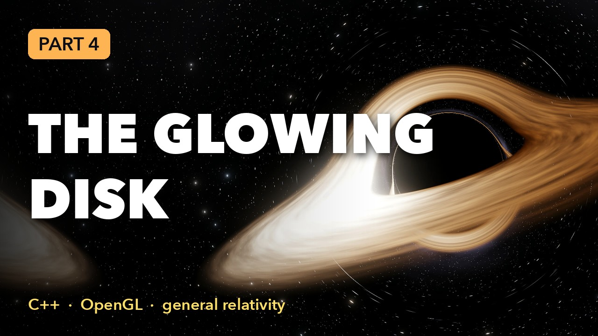

# Black Hole Ray Tracer

A real-time Schwarzschild black hole, ray traced in a fragment shader. Each pixel
integrates one null geodesic with RK4; the accretion disk, its lensed images, the
Doppler/redshift brightening and the shadow all come out of the equations.

Written from scratch in C++17 and OpenGL 4.1. The only dependency is GLFW (window
and GL context), which CMake downloads. `stages/` builds the same thing up in three small
programs, and `presentation/` holds a four-part Manim video series that explains the physics and
the code line by line.

**Watch the series:** Part 1 · Part 2 · Part 3 · Part 4 (links added after upload)

<p align="center"></p>

## Build and run

```sh
cmake -S . -B build
cmake --build build -j
./build/blackhole                 # interactive
ctest --test-dir build            # physics tests
```

Currently macOS only: `src/gl/gl.h` uses the system OpenGL headers. Other platforms
need a function loader (e.g. glad) added there.

| Input | Action |
|---|---|
| drag / scroll | orbit / zoom |
| `D` `G` `R` `B` | toggle disk / grid sky / Doppler + redshift / bloom |
| `[` `]` | coarser / finer integration steps |
| `-` `=` | exposure |
| `Space` | pause the disk |
| `P` | save `blackhole_NNN.png` |
| `F5` | reload shaders |

Headless render: `./build/blackhole --preset edgeon --size 1920x1080 --screenshot out.png`
(presets: `default faceon edgeon grid nodisk close`; run with `--help` for all options).

## How it works

Units are G = c = M = 1. The metric is in Cartesian Kerr-Schild form,
`g = eta + f l l` with `l = (1, L)`, and rays follow Hamilton's equations for
`H = 1/2 g^{mu nu} p_mu p_nu`:

```
A      = L.p - p_t
dx/dl  = p - f A L
dp/dl  = 1/2 A^2 grad f + f A grad(L.p)
```

| File | Role |
|---|---|
| `shaders/metric_schwarzschild.glsl` | `f`, `L` and their gradients: the only place the spacetime is defined |
| `shaders/geodesic.glsl` | Hamiltonian right-hand side, RK4 step, pixel direction to photon momentum |
| `shaders/trace.frag` | per-pixel loop: horizon / escape / disk crossings |
| `shaders/disk.glsl`, `sky.glsl` | disk emission with redshift factor `g`; starfield and grid |
| `shaders/bloom_*.frag`, `tonemap.frag` | HDR post-processing |
| `src/camera.cpp` | orbit camera and its orthonormal tetrad (Gram-Schmidt with the metric) |
| `src/physics.h` | compiles the two physics shaders as C++ for the camera and the tests |
| `src/math/vec.h`, `src/gl/*`, `src/png.cpp` | vector math, shader/framebuffer wrappers, PNG writer |

The metric uses the outgoing Kerr-Schild form (`L = -x/r`) because rays are traced
backwards in time; in those coordinates a backward ray passes through r = 2M smoothly.

### Adding Kerr

Write `metric_kerr.glsl` with the same five functions as `metric_schwarzschild.glsl`
(Kerr `f` and `L` with spin `a`, horizon, ISCO, orbital frequency) and include it in
`trace.frag` and `src/physics.h`. The integrator, camera tetrad and disk shading only
talk to that interface. The static-observer camera in `camera.cpp` would also need
replacing inside the ergosphere.

## Learning stages

`stages/` holds three small programs that build the ray tracer up step by step. Each is one
self-contained `main.cpp` (plus shaders), with the OpenGL calls written out plainly instead of
hidden in helper classes. They are what the video series walks through.

| Program | What it adds | Run |
|---|---|---|
| `stages/01_rays_2d` | The two rules for light and RK4, on the CPU. OpenGL basics: window, two shaders, vertex buffer, draw calls. Move the mouse to aim a ray. | `./build/stage01` |
| `stages/02_raytracer_3d` | The same physics in a fragment shader: fullscreen triangle, orbit camera, uniforms, one ray per pixel, star or grid sky. Drag, scroll, `G`. | `./build/stage02` |
| `stages/03_disk` | The orbiting disk, Doppler and redshift, a clock uniform, an off-screen floating-point image and tone mapping. `R` toggles the redshift factor. | `./build/stage03` |

To keep them short the stages make two simplifications that the full simulator in `src/` does not:
rays are followed forward from the camera (the paths are the same as tracing the light backwards),
and the camera treats space as flat where it sits, which is fine well away from the hole.

## The video series

Four narrated episodes in `presentation/`, pitched at high-school physics level. From episode 2 on,
each one ends with a program you can run:

| File | Episode |
|---|---|
| `blackhole_ep1.mp4` | Why light bends: Newton to Einstein, the metric, the two rules for light |
| `blackhole_ep2.mp4` | Bending light in 2D: stage 1 line by line, OpenGL from zero |
| `blackhole_ep3.mp4` | A ray tracer in 3D: the physics moves into a shader, the camera, one ray per pixel |
| `blackhole_ep4.mp4` | The spinning disk: three images of one disk, orbital speed, Doppler and redshift, tone mapping |

The voice is generated locally with Chatterbox (in its own environment, `.venv-tts`), styled on
`voice_ref/fable.wav`; every clip is transcribed back with Whisper to catch skipped words. Kokoro is
the fallback if Chatterbox is not installed. A soft music bed sits underneath. Portraits of the
scientists are public-domain images; sources are in `presentation/assets/people/sources.json`.
Subtitles are not put in the video; each episode gets a separate `blackhole_epN.srt` to upload as
captions, `chapters_epN.txt` for the description, and `script_epN.md` (the voiceover with timestamps).
Years are spelled out for the voice automatically; add other pronunciation fixes to `spoken()` in `tts.py`.

| File | Role |
|---|---|
| `ep1.py` … `ep4.py` | The scenes. Narration is inline: `with self.voice("..."):` wraps the animation for that sentence |
| `common.py` | Shared pieces: code panels that read the real source files, ray drawing, footage playback |
| `narration.py` | Makes each `voice` block last as long as its sentence, and records the timings |
| `tts.py` | `speak` the sentences into audio clips; `mux` voice, music and subtitles onto an episode |
| `music.py` | Synthesises the music bed (nothing to license) |
| `geodesics.py` | NumPy port of the integrator; every light path drawn in the videos is a real geodesic |
| `footage.sh` | Records clips from the stage programs and the simulator |
| `plan.md` | Episode-by-episode outline |

```sh
cd presentation
python3.12 -m venv .venv && .venv/bin/pip install -r requirements.txt
python3.12 -m venv .venv-tts && .venv-tts/bin/pip install -r requirements-tts.txt
./build_all.sh                       # voice everything (slow), then render all episodes at 1080p
./make.sh                            # all episodes, 1080p
./make.sh h ep2                      # one episode
./make.sh l ep1                      # fast 480p preview
./make.sh h all --engine kokoro      # the faster Kokoro voice instead (needs tts.py setup)
./make.sh h all --speed 1.1          # speak faster
```

The video is timed to the audio: `tts.py speak` writes one clip per sentence to
`audio/<scene>_<n>.wav`, and the render makes each sentence's animation last as long as its clip.
To change the wording, edit the `self.voice("...")` strings; only changed sentences are regenerated.

**Music.** To use your own track, put one audio file in `presentation/music/` (mp3, wav, m4a); it is
looped and lowered while the narrator speaks. Levels are `MUSIC_LEVEL` and `MUSIC_DUCK` in `tts.py`.
`tts.py mux ep1 --no-music` rebuilds an episode's audio without music, without re-rendering.

**A different voice engine.** `tts.py speak --ext mp3 --cmd 'my-tts --text {text} --out {out}'`
runs your command once per sentence (`{text}` is already shell-quoted). You can also replace any
clip with your own recording (mono, 16-bit, 44.1 kHz WAV; ids are in `narration.json`), then run
`tts.py speak` to re-measure and `./make.sh`.

Needs LaTeX (the build looks for TinyTeX in `~/Library/TinyTeX`), ffmpeg, and
`brew install pkgconf cairo pango` so pip can build pycairo.

## License

MIT, see [LICENSE](LICENSE). The portraits in `presentation/assets/people/` are public domain
(sources in `sources.json`).
